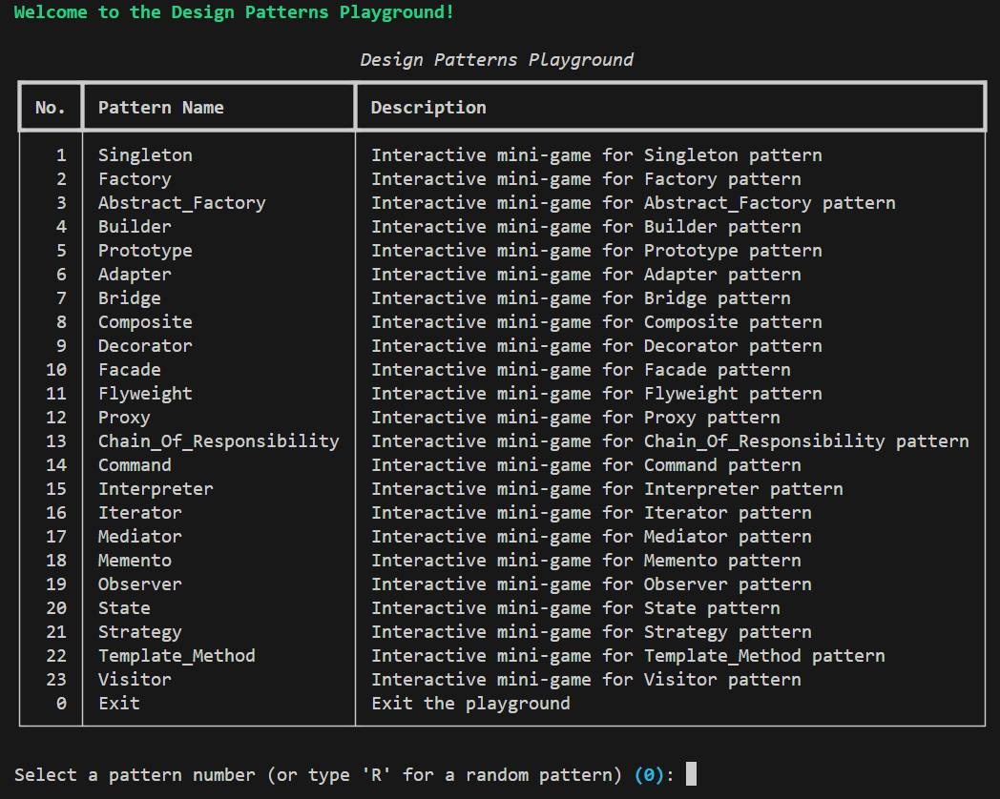
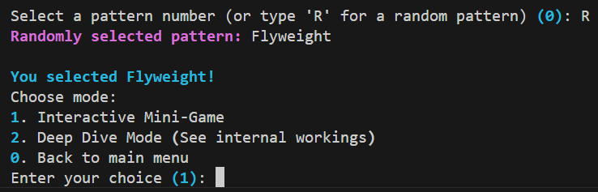
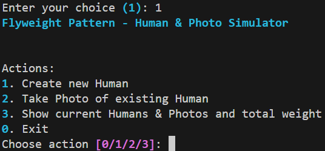
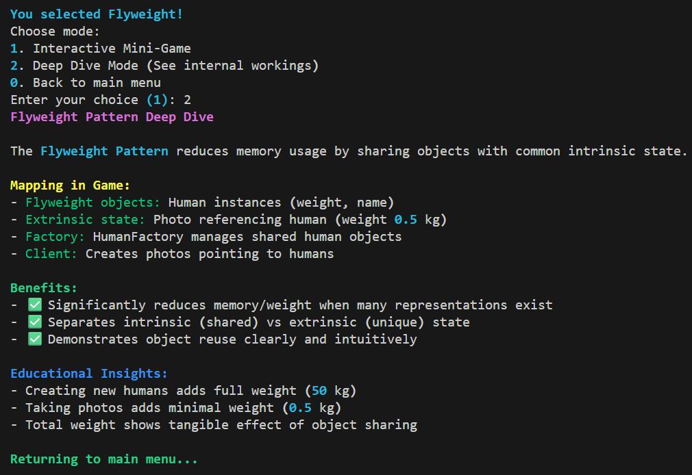
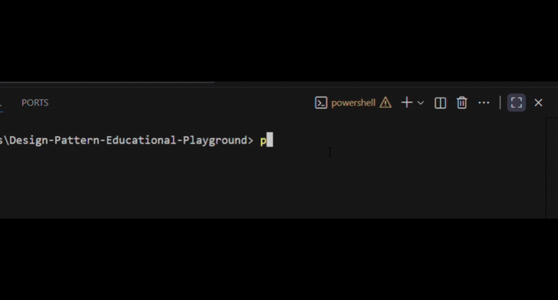
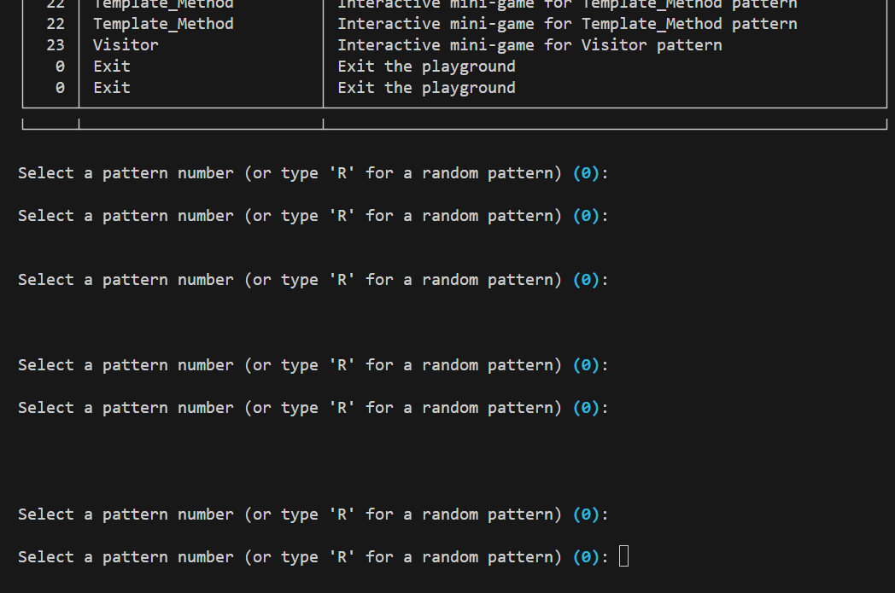
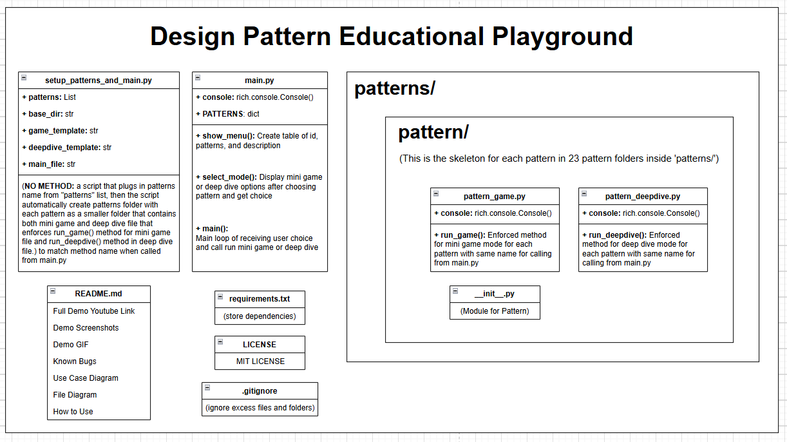

## 📺 YouTube Demo

Check out a full demonstration of the project on YouTube:

[▶️ Watch the Demo](https://youtu.be/daryuTjaDRc)

---

## 🖼️ Project Demo

Here are some screenshots showcasing different parts of the program:

---

### 🏠 Main Menu



To reach this part, follow the **Getting Started** instructions at the bottom of this README to set up and run the program.

This is the **main menu**, where you can explore all **23 design patterns**.
From here, you can:

* Choose a specific design pattern to learn
* Type `R` to get a **random pattern** and start right away
* Type `0` to **exit** the program

Everything happens directly in the **CLI (Command Line Interface)**.

---

### ⚖️ Choose-in-Two Screen



After selecting (or randomizing) a pattern, you’ll reach this screen.
Here, you can **choose between two paths**:

1. Play an **interactive educational mini-game** of that pattern
2. Or **go deep dive** into the **theory explanation** of that pattern

> ⚠️ **Note:** When you choose the deep dive option, the program usually displays the explanation **and then automatically returns to the main menu**.
> So remember to **scroll up** in your terminal to read the deep dive content — otherwise, it may look like it just went back to the main menu.

---

### 🎮 Mini Game Example



This is one of the **interactive mini-games**.
Each one was **brainstormed and designed by me** to make sure it’s:

* Super **educational**
* Intuitive and **easy to understand**
* A fun way to **learn by doing** instead of just reading theory

These games help reinforce the logic behind each design pattern through hands-on interaction.

---

### 🔍 Deep Dive Example



This is the **Deep Dive** section — the **theoretical explanation** of the pattern.
It’s meant to clarify the concepts introduced in the mini-game, giving you a deeper understanding of **how and why** the pattern works.

---

## 🎬 Quick Demo



Here’s a short demo showcasing how the program looks and behaves inside the CLI.
It walks through the core features — from navigating the main menu, choosing a design pattern, and trying out the interactive mini-game or deep dive theory section.

> 💡 This demo is meant to give a quick visual overview of how smooth and interactive the CLI experience is before trying it yourself.

---

## ⚠️ Known Bug: CLI Resize in VSCode



There’s a minor display issue when **resizing the terminal height** in VSCode while running the program:

* If you **increase or decrease the terminal height**, the **tables in the CLI may become glitchy**.
* The **input field may appear duplicated multiple times** in the display.

> ✅ **Important:** Despite the visual glitch, **all functionality still works normally**. You can continue interacting with the program without issues.

> 💡 Tip: To avoid confusion, try to **keep a consistent terminal size** while running the program.

---

## 📊 Use Case Diagram

Here’s the system’s use case diagram for quick reference:


---

## 🗂️ File Structure Diagram



This diagram shows the **overall structure of the project**, making it easier to understand how everything is organized.

The 'pattern' folder represents the skeleton for 23 different design patterns folders inside 'patterns' folder.

* For example, inside 'patterns' folder we have 'strategy' folder which contains '\_\_init\_\_.py', 'strategy_game.py', and 'strategy_deepdive.py'.

---

## 🚀 Play It On Your Device!

Follow these steps to set up and run this project on your local machine.

### 1. Clone the Repository

```bash
git clone https://github.com/WillyPhan06/Design-Pattern-Educational-Playground.git
```

Then, navigate into the project folder:

```bash
cd <your-repo-name>
```

---

### 2. Create and Activate a Virtual Environment

**On Windows:**

```bash
python -m venv venv
venv\Scripts\activate
```

**On macOS / Linux:**

```bash
python3 -m venv venv
source venv/bin/activate
```

> 💡 You’ll know it’s active when you see `(venv)` at the start of your terminal line.

---

### 3. Install Dependencies

Install all required Python packages from `requirements.txt`:

```bash
pip install -r requirements.txt
```

---

### 4. Run the Program

Run the main entry point of the project:

```bash
python main.py
```

---

### 5. (Optional) Deactivate the Virtual Environment

When you’re done working:

```bash
deactivate
```

---

### ✅ Notes

* Requires **Python 3.10+**
* Always install dependencies in the virtual environment (not globally).
* On macOS/Linux, use `python3` and `pip3` if `python` points to Python 2.


